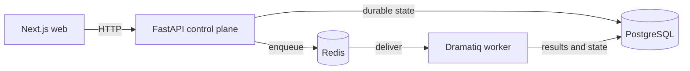

# AgentScope

AgentScope is an open-source evaluation and observability control plane for AI agents. It is intended to help engineering teams capture execution evidence, evaluate behavior, compare agent versions, diagnose regressions, and monitor production quality without coupling the product to a paid observability vendor.

The repository contains a Python tracing SDK, schema-1 trace ingestion and exploration, deterministic
and judge-backed evaluation, human calibration, paired experiments, regression detection and local
Git bisection, fixed-window monitoring, drift incidents, and reproducible local deployment tooling.
The SDK records vendor-neutral traces, delivers them through a bounded HTTP exporter, and offers
optional explicit OpenAI Chat Completions and LangGraph instrumentation.

## Product navigation

The web product uses operator-intent navigation rather than implementation phases:

- **Observe:** Traces and Monitoring.
- **Evaluate:** Evaluations, Calibration, and Experiments.
- **Investigate:** Regressions and its Git bisection evidence.

The root Overview reads one bounded page from each existing product API in parallel. Each area keeps
its own loading, empty, and unavailable state, so a partial API failure does not hide other evidence.
Counts are page-scoped factual summaries—not a health or trust score—and the Overview does not poll.
Existing deep links remain canonical; breadcrumbs and relationship links connect experiments,
regression checks, bisection sessions, monitors, drift comparisons, and incidents.

## Core capabilities

- Next.js, TypeScript, and Tailwind application shell
- FastAPI control plane with liveness and dependency readiness endpoints
- Async SQLAlchemy foundation and a reversible Alembic migration
- PostgreSQL as the system of record
- Redis-backed Dramatiq workers with PostgreSQL-authoritative claims, leases, and recovery
- Versioned, transactional PostgreSQL trace/span ingestion at `POST /api/v1/traces`
- Reproducible Docker Compose development stack
- Human-reference calibration, paired experiments, regression/bisection, and monitoring incidents
- Backend tests, frontend quality gates, packaging validation, and GitHub Actions CI

## Architecture

AgentScope starts as a modular monolith with independently runnable web, API, and worker processes. The API owns synchronous control-plane operations. Dramatiq workers own durable background work. Both share one typed Python package and PostgreSQL remains canonical; Redis is replaceable queue infrastructure.



See [docs/architecture.md](docs/architecture.md) for current boundaries, persistence decisions, and
durable execution pipelines.
See [docs/trace-ingestion.md](docs/trace-ingestion.md) for the exact schema-1 ingestion, response,
atomicity, idempotency, limits, and privacy contract.
See [docs/trace-query.md](docs/trace-query.md) for list/detail responses, filters, cursors, ordering,
aggregates, limits, and privacy semantics.
See [docs/evaluations.md](docs/evaluations.md) for definitions, immutable run snapshots, trace-linked
results, evaluator kinds, lifecycle, validation bounds, and API contracts.
See [docs/calibration.md](docs/calibration.md) for human reference sets, raw annotations, explicit
adjudication, freezing, and reproducible calibration-study snapshots.
See [docs/experiments.md](docs/experiments.md) for explicit A/B trace pairing, provenance and
evaluation-condition snapshots, lifecycle locking, and current causal/statistical limitations.
See [docs/deployment.md](docs/deployment.md) for the supported production-style Compose package,
explicit migration sequence, persistence model, operator commands, and bounded deployment smoke.
See [docs/demo.md](docs/demo.md) for the reproducible 5-minute and 10–15 minute technical
walkthroughs, signature calibration and bisection stories, and scientifically bounded talk track.

## Repository Structure

```text
.
├── apps/
│   ├── api/                 # FastAPI, SQLAlchemy, Alembic, Dramatiq, tests
│   └── web/                 # Next.js application shell
├── packages/
│   └── python-sdk/          # Independently packageable, zero-runtime-dependency tracing SDK
├── docs/
│   └── architecture.md
├── tasks/                   # Phase implementation plan and checklist
├── .github/workflows/ci.yml
├── compose.yaml
├── package.json             # npm workspace and root developer commands
└── .env.example
```

The development Compose file stays at the conventional root discovery path; the production-style
package is explicit through `compose.production.yaml`.

## Technology Choices

| Concern | Choice | Reason |
| --- | --- | --- |
| Web | Next.js 16, React 19, TypeScript, Tailwind CSS 4 | Typed, accessible server-rendered UI with a small styling toolchain |
| API | FastAPI and Pydantic Settings | Typed HTTP contracts and environment validation |
| Persistence | PostgreSQL, SQLAlchemy 2.x, Alembic | Transactional system of record with explicit reversible migrations |
| Background work | Dramatiq and Redis | Simple open-source queue with independently scalable workers |
| Packaging | npm workspaces and Python `pyproject.toml` | Native ecosystem tooling without a monorepo orchestrator |
| Local runtime | Docker Compose | One-command, free, reproducible development infrastructure |

## Prerequisites

- Docker Engine with Docker Compose v2
- Node.js 24+ and npm 11+ for running web checks outside Docker
- [`uv`](https://docs.astral.sh/uv/) for running Python checks outside Docker

Docker is sufficient for running the complete application.

## Quick Start

1. Create a local environment file:

   ```powershell
   Copy-Item .env.example .env
   ```

   On macOS or Linux, run `cp .env.example .env`.

2. Review the development-only credentials in `.env`, then start the stack:

   ```text
   npm run dev
   ```

3. Open the services:

   - Web: <http://localhost:3000>
   - API documentation: <http://localhost:8000/docs>
   - Liveness: <http://localhost:8000/health>
   - Dependency readiness: <http://localhost:8000/ready>

A one-shot Compose migration service applies pending Alembic migrations before the API and worker start. Migrations are not coupled to each API process startup.

For a production-style single-host package with explicit migration execution, use
`compose.production.yaml` and `.env.production.example`; follow [the deployment guide](docs/deployment.md).
The development Compose workflow above intentionally remains unchanged.

### Windows cloud-backed folders

Docker BuildKit may reject build contexts stored in OneDrive or another cloud-backed Windows folder when files carry reparse-point metadata, sometimes reporting `invalid file request Dockerfile`. Use a normal local filesystem checkout, or create a disposable normal-file snapshot outside the synchronized folder and run Compose there. Do not work around this host filesystem issue in application code or by resetting Docker data.

## Environment Variables

| Variable | Purpose | Development default |
| --- | --- | --- |
| `APP_ENV` | Configuration safety mode | `development` |
| `POSTGRES_DB` | Compose database name | `agentscope` |
| `POSTGRES_USER` | Compose database user | `agentscope` |
| `POSTGRES_PASSWORD` | Compose database password | development-only placeholder |
| `DATABASE_URL` | Async SQLAlchemy connection URL | Points at the Compose PostgreSQL service |
| `REDIS_URL` | Dramatiq and readiness Redis URL | `redis://redis:6379/0` in Compose |
| `DEPENDENCY_PROBE_TIMEOUT_SECONDS` | Per-dependency readiness/preflight deadline (0.1–5 seconds) | `1` |
| `EVALUATION_RECOVERY_INTERVAL_SECONDS` | Bounded worker recovery scan interval (10–3,600 seconds) | `60` |
| `BISECTION_MAX_COMMIT_RANGE` | Maximum commits in one immutable local Git investigation plan | `500` |
| `BISECTION_WORK_ROOT` | AgentScope-owned root for disposable detached commit worktrees | Native temporary directory under `agentscope-bisection-worktrees` |
| `BISECTION_EXECUTION_MAX_ATTEMPTS` | Maximum infrastructure attempts per selected commit (1–3) | `3` |
| `CORS_ORIGINS` | Comma-separated allowed web origins | `http://localhost:3000` |
| `NEXT_PUBLIC_API_URL` | Browser-visible API base URL | `http://localhost:8000` |

Never commit `.env`. Production configuration rejects the checked-in development database password,
wildcard or malformed CORS origins, and malformed PostgreSQL/Redis URLs. `OPENAI_API_KEY` is optional
at startup and is required only when an OpenAI-backed judge job executes. Production web builds require
an explicit credential-free HTTP(S) `NEXT_PUBLIC_API_URL`; Compose passes the local value as a build
argument because browser-visible `NEXT_PUBLIC_*` values are compiled into the client bundle.

## Developer Commands

| Command | Purpose |
| --- | --- |
| `npm run dev` | Build and start the complete Compose stack |
| `npm run down` | Stop the stack while retaining PostgreSQL data |
| `npm run logs` | Follow logs for all services |
| `npm run migrate` | Apply Alembic migrations with the one-off migration service |
| `npm run test:api` | Run backend tests in Docker |
| `npm run check:sdk` | Run SDK lint, strict type checking, and tests |
| `npm run example:sdk` | Run the in-memory tracing SDK example |
| `npm run example:sdk:http` | Show safe HTTP exporter configuration without sending a request |
| `npm run example:sdk:openai` | Run the offline two-LLM/one-tool OpenAI-compatible example |
| `npm run example:sdk:langgraph` | Run the offline LangGraph + OpenAI + tool composition example |
| `npm run check:web` | Run frontend tests, lint, type-check, and production build locally |
| `npm run worker` | Run a one-off worker container |

### Deployment preflight

Run the read-only operator check after PostgreSQL and Redis are available and before routing traffic:

```text
docker compose run --rm preflight
```

The command reports `PASS`, `WARNING`, or `FAIL` for configuration, PostgreSQL, Redis, the current
database revision versus repository Alembic heads, and optional OpenAI judge availability. It never
runs migrations, writes application data, enqueues work, or calls OpenAI. A failure exits non-zero;
warnings (including an absent OpenAI key) do not. Dependency and migration failures are deliberately
sanitized and never print connection URLs or credentials.

For a source checkout with dependencies already installed, the equivalent command is
`uv run --project apps/api agentscope-preflight`.

### Backend checks outside Docker

```text
cd apps/api
uv sync --locked --dev
uv run alembic upgrade head
uv run ruff check .
uv run mypy src
uv run pytest -q
```

Integration tests refuse to run unless `APP_ENV=test` and `DATABASE_URL` names a `*_test` database;
their cleanup truncates only that database's `traces` and `spans` tables.
Test mode keeps `NullPool` isolation and uses a bounded five-second connection deadline to tolerate
brief local PostgreSQL startup/acquisition stalls; non-test environments retain the two-second deadline.

## Trace ingestion

`POST /api/v1/traces` accepts the frozen schema-1 envelope:

```json
{"schema_version":"1","traces":[{"trace_id":"tr_...","name":"agent","start_time":"2026-09-17T10:00:00Z","end_time":"2026-09-17T10:00:01Z","status":"success","input":null,"output":null,"error":null,"metadata":{},"tags":[],"spans":[],"duration_ms":1000.0}]}
```

Successful requests return HTTP `202` and `{"accepted":1,"duplicates":0}`. Exact retries return
`202` with the trace counted under `duplicates`; mixed new/duplicate batches report both counts.
Reusing a `trace_id` for materially different canonical content returns `409 TRACE_CONFLICT` and
rolls back the whole batch. Malformed or invalid schema-1 data returns `422 VALIDATION_ERROR`, unknown
versions return `422 UNSUPPORTED_SCHEMA_VERSION`, and bodies over 4 MiB return
`413 REQUEST_TOO_LARGE`. Safe `500 PERSISTENCE_ERROR` responses expose no database detail.

The endpoint accepts an optional visible-ASCII `Idempotency-Key` (maximum 255 characters) for SDK
compatibility. It is not authentication and does not replace trace-level deduplication. Ingestion is
currently unauthenticated and intended only for loopback-bound local deployments. Request payloads, bearer tokens,
prompts, outputs, and arbitrary metadata are never logged.

## Local Demo

With the Compose stack running and migrations applied, create the complete deterministic sample
workspace from the repository root:

```powershell
uv run --project apps/api python apps/api/scripts/seed_demo.py
```

The command normally completes in a few minutes, is safe to rerun, prints created/reused counts and
a canonical evidence-route manifest, and never calls OpenAI or another paid/network provider. It adds 20 fixed
synthetic traces plus completed evaluation, calibration, paired experiment, regression, monitoring,
drift, and incident evidence. Existing non-demo rows are neither changed nor deleted. Open
`http://localhost:3000`; records labeled **AgentScope Demo** are synthetic sample evidence.

The Git investigation is deliberately separate. It creates or reuses only a marker-owned repository
under the operating-system temporary directory, executes a five-commit local probe, and proves the
previous-good/first-regressed boundary without checking out or changing this repository:

```powershell
docker compose exec -T api python scripts/run_bisection_demo.py
```

Recommended walkthrough: **Overview → Traces → Calibration → Experiments → Regressions → Bisection
→ Monitoring incident**. The seed command demonstrates Definition ≠ Run ≠ Result, human truth versus
deterministic judge decisions, canonical FP/FN and kappa evidence, paired A/B changes without an
automatic winner, a non-causal practical regression, and fixed-window incident history. No API key,
internet access, remote Git repository, or destructive reset is required.
Use [the demo walkthrough](docs/demo.md) for the timed route-by-route narrative and interview talk
track.

## Trace queries

`GET /api/v1/traces` returns bounded, newest-first summaries with opaque keyset pagination and typed
status, name, timestamp, duration, error-presence, and span-kind filters.
`GET /api/v1/traces/{trace_id}` returns the complete public trace and deterministic parent-first spans.
Token totals distinguish unknown (`null`, rendered as `—`) from a measured zero. Cursor traversal is
deterministic but not snapshot-isolated across separate requests; restart paging for a fresh view.

## Trace Explorer

Open `http://localhost:3000/traces` for the real-API trace list or deep-link to
`http://localhost:3000/traces/{trace_id}`. Filters are shareable URL parameters; pagination uses the
backend cursor through a “Load more” control. Detail pages reconstruct the span tree from
`parent_span_id` and show conditional LLM, tool, error, event, attribute, and metadata inspectors.

Create 28 realistic local traces through the ingestion API:

```powershell
uv run --project apps/api python apps/api/scripts/seed_demo_traces.py
```

Remove only those clearly prefixed fixtures (span rows cascade with their trace):

```powershell
docker compose exec -T postgres psql -U agentscope -d agentscope -c "DELETE FROM traces WHERE trace_id LIKE 'demo-p3-%';"
```

See [docs/trace-explorer.md](docs/trace-explorer.md) for UI behavior, architecture, testing data, and
limitations.

## Evaluation domain

AgentScope provides validated evaluation definitions, immutable run snapshots, per-trace results, and
durable Dramatiq orchestration for exact match, literal contains, and inclusive numeric threshold
evaluators. Clients submit a bounded immutable trace set with
`POST /api/v1/evaluation-runs/{run_id}/execute`, then poll server-derived run summaries and bounded
result pages. The `/evaluations` UI supports definition creation, run creation, safe trace selection,
asynchronous submission, outcome filtering, and result-to-trace navigation. See
[docs/evaluations.md](docs/evaluations.md).

## Human reference and LLM judge calibration

Calibration stores bounded human reference sets and stable study subjects alongside immutable OpenAI
judge configurations, snapshotted asynchronous runs, structured decisions, durable per-subject
progress, and renewable lease-fenced recovery. Completed runs expose reproducible confusion matrices,
precision/recall/F1/specificity, Cohen's kappa, and paginated disagreement identities. The
`/calibration` product workflow supports human labeling,
study/configuration/run creation, canonical reports, trace-linked disagreement inspection, and
descriptive run comparison. Set `OPENAI_API_KEY` in the environment to submit real execution; tests
use injected fakes and never make paid calls. See [docs/calibration.md](docs/calibration.md).

## Experiments

Experiments use exactly two stable A/B variants, ordered pairs of distinct trace executions, and
ordered snapshots of existing evaluation definitions. Moving an experiment to `ready` freezes that
evidence. Durable lease-fenced execution persists retry-safe raw decisions and canonical paired
analysis, including exact McNemar tests, deterministic bootstrap intervals, and trace-linked changed
subjects. The experiment dashboard exposes configuration, runs, and reports without declaring a
winner. Immutable, explicitly oriented regression checks apply practical policies to that analysis.
Read-only Git ancestry validation creates bounded commit plans; argv-only probes run selected commits
in detached AgentScope-owned worktrees with bounded output and attempts. A persisted coordinator
reuses exact-compatible evidence, skips unusable results deterministically, and blocks non-monotonic
attribution. The `/regressions` workflow connects experiment evidence, policy/check evidence, Git planning,
argv-only probe configuration, active-only analysis polling, persisted decision history, terminal
attribution, inconclusive outcomes, and bounded execution evidence. AgentScope identifies the first
observed regression boundary under a frozen probe and commit range; this is evidence for
investigation, not automatic proof of causal root cause. See
[docs/experiments.md](docs/experiments.md).

## Production monitoring

Monitoring uses reusable definitions and immutable snapshots over aligned, fully
closed UTC windows. Workers persist trace reliability/latency/token metrics and optional deterministic
evaluation quality counts with explicit null semantics for missing evidence. Snapshot intent, leases,
bounded attempts, closed-window discovery, and broker-outage recovery remain PostgreSQL-authoritative.
Create/read drift policies synchronously compare eligible baseline/current snapshots using explicit
practical thresholds and conservative minimum-evidence semantics. `/monitoring` completes the
definition → snapshot → comparison → automatic check → incident workflow, while `/metrics` exposes
fixed-label Prometheus-compatible operational counts without an added dependency. See
[docs/monitoring.md](docs/monitoring.md).

### Frontend checks outside Docker

```text
npm ci
npm run check:web
```

### Python tracing SDK

The independently packageable SDK lives in `packages/python-sdk` and has no runtime dependencies.
It uses context-local state so nested spans inherit their parent without leaking between concurrent
asyncio tasks. Its bounded HTTP exporter performs delivery outside the application/event-loop thread.
OpenAI and LangGraph support are independent optional extras. Both adapters are explicit, preserve
context-local nesting, and default to metadata-only capture. The LangGraph baseline supports local
`invoke`/`ainvoke`; streaming and interrupt-session aggregation remain out of scope.
See [its README](packages/python-sdk/README.md) for the public API, wire contract, lifecycle,
serialization, sensitive-data boundary, and current limitations.

## Migrations

Apply all migrations:

```text
npm run migrate
```

Create a migration after changing SQLAlchemy metadata:

```text
docker compose run --rm api alembic revision --autogenerate -m "describe change"
```

Always inspect generated migrations and verify both `upgrade()` and `downgrade()` before committing them.

## Worker Demonstration

With the stack running, enqueue the demonstration job:

```text
docker compose exec api python -c "from agentscope_api.jobs.demo import demo_job; demo_job.send()"
docker compose logs worker
```

The worker logs `Demo job completed: AgentScope worker is ready`. It does not modify canonical data.

## Health Semantics

- `GET /health` returns `200` when the API process can serve requests. It does not probe dependencies.
- `GET /ready` concurrently probes PostgreSQL with read-only `SELECT 1` and Redis with `PING`, bounded
  by `DEPENDENCY_PROBE_TIMEOUT_SECONDS`. It returns `200` only when both are available, otherwise
  `503` with only each dependency's `ok`/`unavailable` state.

This separation lets an orchestrator restart dead processes without routing traffic to a live process whose required dependencies are unavailable.
The API container healthcheck intentionally uses liveness; readiness remains independently queryable
by a load balancer or deployment controller. PostgreSQL and Redis interruptions therefore stop new
traffic without causing restart cascades. API shutdown bounds database-pool disposal to five seconds;
the worker receives a 30-second Compose grace period, after which existing lease/fencing recovery can
resume interrupted durable work.

## Current Limitations

- Trace Explorer is request/response based; live polling and streaming are not implemented.
- Production authentication, tenancy, rate limiting, retention, and payload redaction are not implemented.
- The demonstration job remains a queue smoke path; evaluation jobs use PostgreSQL claims and
  uniqueness constraints for idempotency.
- Host ports bind to loopback for local development; production exposure requires an explicit deployment design.
- Remote alert delivery and hosted Prometheus/Grafana are not included; `/metrics` supports local
  compatible scraping only.
- Grafana, Kafka, Kubernetes, and paid SaaS dependencies are not included.

## Implementation status

The tracing SDK, ingestion/query APIs, product workflows, durable background execution, calibration,
paired statistics, regression/bisection evidence, monitoring incidents, deterministic demo, and
production-style local package are implemented. The remaining release step is the separately run
whole-project human audit described by the project process; it is not replaced by automated gates.
