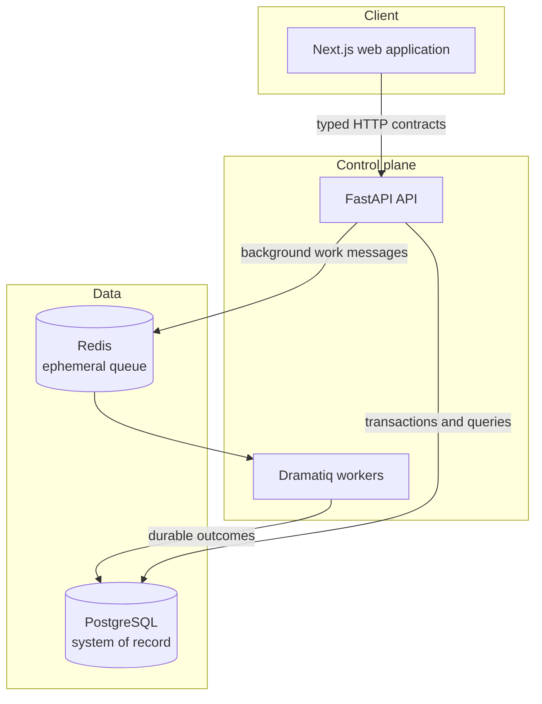
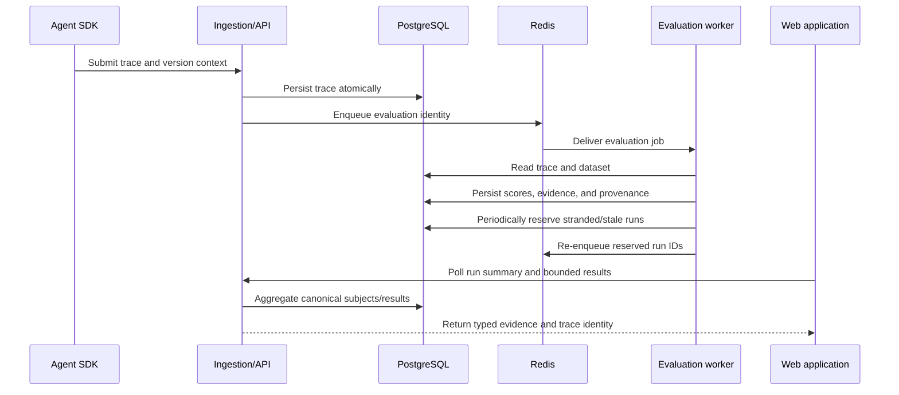

# AgentScope Architecture

## Context

AgentScope turns agent executions into defensible engineering evidence: traces, evaluations,
calibration, comparisons, regressions, and production quality signals. It uses explicit process
boundaries and PostgreSQL-backed persistence rules across those implemented domains.

## System Boundaries



### Python tracing SDK

External agent applications may depend on `packages/python-sdk` without depending on the AgentScope
server. The SDK owns trace/span contracts, context-local nesting, lifecycle timing, serialization,
and an exporter interface. It has no runtime dependencies and does not import FastAPI, SQLAlchemy,
Dramatiq, Redis, or server modules.

Trace and span IDs are assigned in the instrumented process. Timestamps serialize as UTC RFC 3339,
while elapsed durations use a monotonic clock. Spans are stored as a flat ordered collection with
`parent_span_id` relationships, keeping transport simple without losing the execution tree. Typed
LLM attributes cover provider, model, operation, token usage, finish reason, tool calls, and
temperature; JSON-compatible metadata and attributes remain the bounded extension mechanism.

Python `contextvars` carry the active trace and span across synchronous nesting and asyncio task
creation without process-global mutable context. Completed traces cross exactly one boundary—the
`TraceExporter` protocol. The HTTP implementation serializes and enqueues on the caller thread, then
uses one bounded background worker for batching, network I/O, and retry backoff. This keeps sync
network calls off asyncio agent tasks without creating separate instrumentation APIs.

The frozen client wire contract is `POST /api/v1/traces` with schema `"1"` in a versioned JSON
envelope containing one to ten unchanged trace records. The envelope version defines the nested trace
shape; records do not repeat it. A stable `Idempotency-Key` identifies the delivery attempt for one
trace or an ordered batch, while `trace_id` is the canonical persistence identity.

The ingestion service persists accepted requests in one PostgreSQL transaction. Queryable trace and span columns
hold identity, names, kinds, statuses, timestamps, and durations; JSONB preserves inputs, outputs,
errors, metadata, tags, events, attributes, and LLM data. A composite deferred foreign key restricts
parents to the same trace and permits children to precede parents in the flat payload. The API checks
the complete graph for missing parents, self-parenting, cycles, mismatched trace IDs, and duplicate
span IDs before writing.

Each trace stores a SHA-256 fingerprint of its canonical schema-1 representation. PostgreSQL
`ON CONFLICT DO NOTHING` on the trace primary key selects the sole concurrent winner. An existing ID
with the same fingerprint is an idempotent duplicate; a different fingerprint is a `409` conflict and
rolls back every new trace in that request. The server validates but does not persist the optional
`Idempotency-Key`; trace-level identity remains authoritative and no request-key subsystem is needed.
Transient client failures still receive bounded retries; the SDK queue remains memory-only.

Provider adapters depend inward on the generic core; the core never imports OpenAI. The optional
OpenAI adapter explicitly wraps sync/async Chat Completions calls, normalizes selected response
fields into existing LLM types, and defaults to metadata-only capture. It does not monkey-patch,
execute tools, or retain provider/client objects. Raw tool execution continues to use generic TOOL
spans, so the resulting hierarchy remains portable across providers.

The optional LangGraph adapter also depends inward on the same core. It wraps only a caller-selected
`invoke` or `ainvoke` and injects a handler through LangGraph's public per-invocation callback config.
The wrapper owns one trace only when no AgentScope trace is active, adds a WORKFLOW span, and maps
actual graph-step callbacks to conservative CUSTOM node spans. LangGraph propagates contextvars into
async tasks and thread-parallel nodes; explicit OpenAI and TOOL spans created inside a node therefore
remain children of that node. Metadata-only capture is the default, and existing invocation callbacks
are preserved. Streaming and multi-invocation interrupt/session aggregation remain outside scope.

### Frontend

The Next.js application is the human control surface and queries the API rather than accessing
storage directly. `/traces` owns URL-synchronized filters and cursor-based “Load more” state;
`/traces/[traceId]` fetches detail only when opened. A small typed client centralizes query
serialization, abortable requests, runtime response checks, and safe error messages. List rows use
server-computed summaries and never fetch spans per row. Detail reconstructs the validated flat span
sequence from `parent_span_id` and renders it with local component state; no global state library is
needed.

```text
Browser → Next.js Trace Explorer → typed API client → FastAPI query API
        → TraceQueryService → PostgreSQL
```

### API / Control Plane

FastAPI owns synchronous HTTP contracts, boundary validation, and orchestration. `/health` represents process liveness. `/ready` checks required infrastructure and returns `503` when PostgreSQL or Redis is unavailable. Domain routes will be added in cohesive modules rather than separate deployable services.

`POST /api/v1/traces` is currently an unauthenticated local-development ingestion boundary. It accepts
at most 4 MiB, ten traces per batch, and 10,000 spans per trace. Schema-1 models reject unknown fields,
unknown versions/enums, non-finite or invalid durations, naive or reversed timestamps, oversized JSON
complexity, and invalid span graphs. Logs record only outcome, counts, category, and duration—never
trace payloads, prompts, model responses, arbitrary metadata, authorization values, or idempotency keys.
Production exposure still requires authentication, tenancy, rate limits, and retention policy.

`GET /api/v1/traces` and `GET /api/v1/traces/{trace_id}` form a typed read boundary. The list uses
`(started_at, trace_id)` keyset pagination and binds opaque cursors to normalized filters. PostgreSQL
computes list aggregates in one query; detail retrieval returns one bounded trace and a flat,
deterministic parent-before-child span sequence. Backend validation, backend ordering, and frontend
tree reconstruction use iterative linear traversals so the 10,000-span contract does not depend on
Python or JavaScript recursion depth.

The evaluation module separates reusable definitions, execution runs, and per-trace results.
Runs copy the definition name, kind, and normalized configuration when created, so historical work
does not depend on mutable current configuration. Results reference existing traces rather than copy
their payloads and are written only through an internal service while public HTTP remains read-only.
Async submission stores ordered subjects before sending a run-ID-only Redis message. Workers use
separate short claim and finalization transactions, evaluate after releasing database resources, and
guard finalization with a bounded claim generation. PostgreSQL uniqueness and lifecycle checks remain
authoritative. Run reads use grouped subject/result subqueries for server-derived progress and outcome
summaries, and result reads join only trace identity for display. The web UI consumes those typed reads,
polls only queued/running runs, and reuses the canonical trace list for privacy-preserving selection. See
[evaluations.md](evaluations.md) for the exact input, evaluator, lifecycle, transaction, recovery,
score, aggregate, pagination, validation, and UI contracts.

The calibration module keeps human evidence separate from machine evaluation results. A
reference set owns bounded ordered trace membership, per-annotator raw judgments, and separately
adjudicated authoritative labels. PostgreSQL row locks serialize lifecycle-sensitive writes through
`draft -> labeling -> frozen`. A calibration study requires a complete frozen set and snapshots only
ordered trace identities and authoritative labels, so later judge execution cannot observe a moving
human reference. Completed judge runs may produce one canonical `calibration_analyses` row. The pure
calculator owns confusion-matrix and kappa semantics; the persistence service separately enforces
complete population alignment and idempotent creation. Disagreement reads join existing study and
result rows rather than duplicating trace or human-review payloads. See
[calibration.md](calibration.md) for the exact invariants and API.

The monitoring module stores reusable trace/evaluation scopes and one immutable aggregate
snapshot per aligned closed UTC window. Snapshot workers use the existing UUID lease and periodic
recovery pattern. Trace duration/token absence remains null, evaluator errors remain separate from
failures, and all browser/API consumers read canonical persisted metrics. See
[monitoring.md](monitoring.md). Synchronous drift comparisons snapshot ordered policy rules and
baseline/current evidence atomically; descriptive rate p-values never replace practical thresholds.

Compose runs Alembic as a one-shot migration service after PostgreSQL is healthy and before the API or worker starts. This preserves explicit migration ordering without making every API replica responsible for schema changes.

### Worker

Dramatiq workers consume Redis messages independently from the API process. They share configuration, models, and services with the API through the `agentscope_api` package. Future long-running evaluation work belongs here; HTTP handlers should enqueue it and return an operation identity rather than holding a request open.

Dramatiq provides at-least-once delivery. Evaluation and monitoring messages therefore contain only
their durable UUID;
PostgreSQL atomically claims each run and commits its complete ordered result set. A supervised
Dramatiq middleware fork performs immediate and 60-second periodic bounded recovery. Concurrent
instances reserve rows with PostgreSQL locks before enqueue; duplicate messages remain harmless.
Dramatiq's built-in AsyncIO middleware keeps worker database activity on a persistent event loop
instead of sharing an async connection pool across per-message loops.

### PostgreSQL

PostgreSQL is the canonical store for configuration, trace/evaluation data, experiment definitions,
job outcomes, and provenance. Alembic is the only schema-change mechanism. `traces` and `spans` are
the durable ingestion model; `evaluation_definitions`, `evaluation_runs`,
`evaluation_run_subjects`, and `evaluation_results` are the evaluation foundation; the
`app_metadata` table remains unchanged. `human_reference_sets`, `human_reference_subjects`,
`human_annotations`, `calibration_studies`, and `calibration_study_subjects` are the human-reference
foundation. `judge_configurations`, `calibration_judge_runs`, and `calibration_judge_results` store
remote-judge provenance, renewable leases, and per-subject outcomes. `calibration_analyses` stores
one constrained, versioned statistical snapshot per completed judge run.
`monitoring_definitions` and `monitoring_snapshots` store bounded scopes, aligned windows, aggregate
evidence, and durable lease/recovery state. `drift_policies`, `drift_policy_rules`,
`drift_comparisons`, and `drift_findings` store explicit comparison rules and frozen evidence without
adding incident or alert state.
Explorer-oriented indexes cover trace name/status/start time, stable `(started_at, trace_id)` paging,
and span kind/status/start time/parent traversal. Evaluation indexes cover deterministic created-time
lists and the supported definition, status, run, and trace filters.

### Redis

Redis is the Dramatiq broker and may later hold short-lived coordination data. It is not a source of truth. Losing Redis may delay or redeliver work, but must not erase canonical AgentScope records.

## Evaluation Pipeline

The sequence below is current for deterministic evaluation: the service implements durable submission,
queue wake-up, worker claim, execution, fenced atomic finalization, bounded periodic recovery, and
browser inspection.



Drift comparison remains a synchronous module inside the existing monolith. Automatic checks and
incidents consume its persisted classifications without recomputing snapshot evidence; remote alert
delivery remains outside the local product boundary.

## Scalability Direction

- Run multiple stateless API replicas behind a load balancer.
- Scale Dramatiq workers horizontally by queue and workload characteristics.
- Keep job payloads small: pass durable identifiers, then load canonical inputs from PostgreSQL.
- Add PostgreSQL indexes and partitioning only after query evidence supports them.
- Add vendor-neutral OpenTelemetry export and Prometheus metrics at runtime boundaries.
- Introduce a separate service only when ownership, scaling, or failure isolation cannot be achieved cleanly with modules and processes.

## Architectural Decisions

### Modular monolith before services

One Python package keeps transactions, contracts, and domain changes easy to reason about. Separate API and worker processes provide the operational isolation needed now without distributed-system overhead.

### PostgreSQL is canonical; Redis is ephemeral

Relational constraints and transactions fit evaluation evidence and provenance. Treating Redis as disposable prevents queue availability from becoming data durability.

### Workload-specific recovery ownership

Queued send reservations and running attempt generations are durable in PostgreSQL. The current
five-minute running-stale threshold is intentionally sized for local deterministic evaluators.
Remote judge runs use a random attempt-owned lease renewed every 20 seconds. Result writes verify the
lease token, attempt generation, and expiry; recovery reclaims only expired remote leases.

### Async API and database access

FastAPI and SQLAlchemy use async I/O so dependency probes and database requests do not block request
workers during network waits. CPU-heavy or long-running work remains in Dramatiq.

### Explicit liveness and readiness

The process can be alive while dependencies are degraded. Separate endpoints preserve that distinction for Compose now and orchestrators later.

### Native tooling over a monorepo framework

npm workspaces, `uv`, Alembic, and Docker Compose already cover installation, checks, migrations, and orchestration. Nx, Turborepo, Make, or a custom task runner would add another abstraction before the repository has enough packages to justify it.

### Root Compose file

Keeping `compose.yaml` at the repository root makes `docker compose` and the root npm scripts work without path flags. An `infra/` directory should be introduced when deployment manifests or observability configuration create a real grouping need.

## Security and Configuration

Configuration is environment-driven and validated at process startup. Development defaults are intentionally local, `.env` is ignored, production mode rejects the development database password, and Compose host ports bind to loopback. CORS is explicit and credentials are disabled until an authentication design exists. Containers run application processes as non-root users.

Future ingestion endpoints will require authentication, payload limits, tenant isolation, rate limits, and explicit retention rules before accepting untrusted production traffic.

The raw SDK enforces JSON-compatible values, recursion/depth checks, timezone-aware timestamps, and
a default 1 MiB serialized payload limit. It deliberately does not guess or redact secrets:
instrumented applications own data classification and must keep credentials and prohibited personal
data out of traces.
